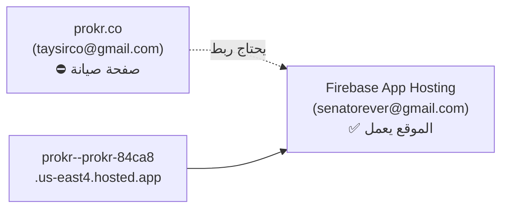

# 🚀 خطة إطلاق Prokr.co الشاملة — الخطة التنفيذية الكاملة

## الهدف
إطلاق موقع prokr.co بشكل آمن عبر ربط الدومين بـ Firebase App Hosting (حساب senatorever@gmail.com)، مع تأمين الإطلاق التدريجي لتجنب عقوبات جوجل.

## الوضع الحالي



| البيئة | الحساب | الحالة |
|--------|--------|--------|
| **prokr.co** (الدومين) | taysirco@gmail.com | ⛔ صفحة صيانة |
| **Firebase App Hosting** (الموقع الجديد) | senatorever@gmail.com | ✅ يعمل بالكامل |
| **Firebase Project** | prokr-84ca8 | senatorever@gmail.com |

---

## User Review Required

> [!IMPORTANT]
> **القرار 1**: ربط دومين prokr.co بـ Firebase App Hosting يتطلب تعديل سجلات DNS. هل تملك وصولاً لإعدادات DNS للدومين prokr.co؟ (Namecheap, GoDaddy, Cloudflare, etc.)

> [!WARNING]
> **القرار 2**: الموقع القديم على حساب taysirco@gmail.com — هل يوجد بيانات مهمة عليه تحتاج نقل؟ أم مجرد صفحة صيانة؟

> [!IMPORTANT]
> **القرار 3**: هل لديك حساب Google Search Console مُعد لـ prokr.co؟ إذا لا، سنحتاج إعداده.

---

## التغييرات المطلوبة

### المرحلة 1: التعديلات البرمجية (قبل ربط الدومين)

---

#### [MODIFY] [sitemap.ts](file:///Users/ahmedsalem/Desktop/all%20my%20projects/prokr.co/prokr/src/app/sitemap.ts)

**المشكلة**: الـ sitemap الحالي يُخرج **كل الصفحات دفعة واحدة** (900+ صفحة). هذا يُصنّف كـ "Spam Spike" عند جوجل ويُعرّض الموقع لعقوبة SpamBrain.

**الحل**: إضافة نظام **Fibonacci Crawl-Drip** الذي يكشف الصفحات تدريجياً بناءً على تاريخ الإطلاق:

```typescript
// LAUNCH_DATE: تاريخ الإطلاق الفعلي — يُحدَّث يدوياً يوم الإطلاق
const LAUNCH_DATE = new Date('2026-04-06');

// Fibonacci Drip: عدد الأيام منذ الإطلاق يحدد عدد المدن المكشوفة
function getAllowedCityCount(): number {
  const daysSinceLaunch = Math.floor(
    (Date.now() - LAUNCH_DATE.getTime()) / (1000 * 60 * 60 * 24)
  );
  // Fibonacci progression: 4, 9, 14, 25, ALL
  if (daysSinceLaunch < 1) return 4;   // يوم 0: ↓ الرياض + جدة + الدمام + مكة
  if (daysSinceLaunch < 3) return 9;   // يوم 1-2
  if (daysSinceLaunch < 5) return 14;  // يوم 3-4
  if (daysSinceLaunch < 8) return 25;  // يوم 5-7 
  return 999;                          // يوم 8+: الكل
}
```

**التفاصيل**:
- Sitemap 0 (Static + Cities): يكشف المدن تدريجياً حسب الأولوية (الرياض/جدة/الدمام أولاً)
- Sitemaps 1-5 (Service pages): تبقى مخفية حتى يوم 8+ (بعد فهرسة المدن)
- Sitemap 6 (Sub-regions): تبقى مخفية حتى يوم 14+
- Sitemap 7 (Blog): يبدأ من يوم 3

**ملاحظة**: النظام تلقائي بالكامل — فقط عدّل `LAUNCH_DATE` والباقي يعمل وحده.

---

#### [MODIFY] [layout.tsx](file:///Users/ahmedsalem/Desktop/all%20my%20projects/prokr.co/prokr/src/app/layout.tsx)

**التعديل**: إضافة `NEXT_PUBLIC_GSC_ID` كمتغير بيئة في `apphosting.yaml` وربطه بالـ verification tag.

السطر 96 الحالي:
```typescript
google: process.env.NEXT_PUBLIC_GSC_ID || 'YOUR_GSC_VERIFICATION_CODE',
```
سيعمل تلقائياً بمجرد إضافة المتغير

---

#### [MODIFY] [apphosting.yaml](file:///Users/ahmedsalem/Desktop/all%20my%20projects/prokr.co/prokr/apphosting.yaml)

**إضافة** متغيرات البيئة المطلوبة:

```yaml
  - variable: NEXT_PUBLIC_GSC_ID
    value: "YOUR_GSC_VERIFICATION_CODE"  # يتم تحديثه بعد إعداد GSC
  - variable: NEXT_PUBLIC_GA_ID
    value: "G-H1W3HDFHS0"
```

---

### المرحلة 2: ربط الدومين بـ Firebase App Hosting

> [!IMPORTANT]
> هذه الخطوة تتم من حساب **senatorever@gmail.com** في Firebase Console

#### الخطوات:

**الخطوة 2.1**: الدخول على Firebase Console
```
1. سجل دخول بـ senatorever@gmail.com
2. اختر مشروع prokr-84ca8
3. اذهب إلى App Hosting → prokr (backend)
4. اضغط "Custom domains" → "Add custom domain"
5. أدخل: prokr.co
```

**الخطوة 2.2**: تعديل DNS Records
```
Firebase سيطلب منك إضافة records في مسجل الدومين:

الخيار A (إذا الدومين على Cloudflare/Namecheap):
  Type: A     → Record: prokr.co    → Value: [IP من Firebase]
  Type: AAAA  → Record: prokr.co    → Value: [IPv6 من Firebase]
  Type: CNAME → Record: www         → Value: prokr.co

الخيار B (إذا Firebase يطلب CNAME verification):
  Type: TXT   → Record: _acme-challenge.prokr.co → Value: [token من Firebase]
```

**الخطوة 2.3**: إزالة أي DNS records قديمة
```
⚠️ احذف أي A/AAAA records قديمة تشير لاستضافة taysirco@gmail.com
⚠️ تأكد من عدم وجود redirect rules على مستوى DNS
```

**الخطوة 2.4**: انتظار SSL + Propagation
```
- الـ SSL certificate: يتم تلقائياً (Let's Encrypt عبر Firebase)
- DNS Propagation: 5 دقائق - 48 ساعة (عادة أقل من ساعة)
```

---

### المرحلة 3: إعداد Google Search Console

#### الخطوات:

**الخطوة 3.1**: إنشاء حساب GSC
```
1. اذهب إلى https://search.google.com/search-console
2. سجل دخول (يفضل بحساب senatorever@gmail.com)
3. اضغط "Add Property"
4. اختر "Domain" → أدخل: prokr.co
5. جوجل سيطلب إثبات الملكية عبر DNS TXT record
```

**الخطوة 3.2**: إثبات الملكية
```
أضف في DNS:
Type: TXT → Record: prokr.co → Value: google-site-verification=XXXXXXXXXXXXX
```

**الخطوة 3.3**: بعد الإثبات
```
1. اذهب إلى Sitemaps
2. أضف: https://prokr.co/sitemap.xml
3. ✅ اضغط Submit
```

**الخطوة 3.4**: تحديث `apphosting.yaml`
```yaml
  - variable: NEXT_PUBLIC_GSC_ID
    value: "google-site-verification=XXXXXXXXXXXXX"  # الكود الحقيقي
```

---

### المرحلة 4: الإطلاق الفعلي (ساعة الصفر)

#### 4.1 Pre-flight Checklist

| # | العنصر | الإجراء |
|---|--------|---------|
| 1 | DNS يشير لـ Firebase | `dig prokr.co` يعيد IP صحيح |
| 2 | SSL شغال | https://prokr.co يفتح بدون تحذير |
| 3 | الصفحة الرئيسية | تعرض المحتوى الكامل |
| 4 | صفحات المدن | /riyadh, /jeddah, /dammam تعمل |
| 5 | robots.txt | https://prokr.co/robots.txt يسمح بالزحف |
| 6 | Sitemap | https://prokr.co/sitemap.xml يعرض 4 صفحات فقط |
| 7 | Security Headers | securityheaders.com يعطي A+ |
| 8 | Mobile | يعمل على الهاتف |
| 9 | PageSpeed | **85-90** (ليس 100!) |

#### 4.2 تشغيل Omega Ignition (تسخين الكاش)

```bash
cd ~/Desktop/"all my projects"/prokr.co/prokr

# تشغيل جاف أولاً:
python3 omega_ignition.py --dry-run --base=https://prokr.co

# ثم التشغيل الفعلي:
python3 omega_ignition.py --base=https://prokr.co --concurrency=20
```

#### 4.3 إرسال Indexing API (4 صفحات فقط)

```
https://prokr.co/
https://prokr.co/riyadh
https://prokr.co/jeddah
https://prokr.co/dammam
```

#### 4.4 إطلاق حملة Brand Search

> [!IMPORTANT]
> **أهم خطوة تسويقية في الأسبوع الأول!**
> لا تضع رابط الموقع مباشرة — اطلب من الناس **البحث في جوجل**.

```
📱 على سناب شات / تيك توك / تويتر:

"⚠️ قبل ما تتعاقد مع أي شركة خدمات منزلية،
افتح جوجل واكتب: «دليل بروكر»
وتأكد من التقييمات والأسعار أولاً 👆"

أو رابط بحث جوجل:
https://www.google.com/search?q=دليل+بروكر+خدمات+منزلية
```

- ميزانية إعلانات: 10-50 $/يوم
- مدة: أسبوع كامل
- استهداف: السعودية فقط
- الهدف: 50+ بحث يومي عن "دليل بروكر"

---

### المرحلة 5: فترة العزل الهوائي (14 يوم)

> [!CAUTION]
> **ممنوع منعاً باتاً خلال أول 14 يوم:**
> 1. ❌ لا 301 redirects من المواقع القديمة
> 2. ❌ لا شراء روابط خلفية
> 3. ❌ لا تغييرات جذرية في الهيكل
> 4. ❌ لا رفع 100+ صفحة دفعة واحدة

#### الجدول الزمني التفصيلي

| اليوم | Sitemap | الإجراء | الملاحظات |
|-------|---------|---------|----------|
| **0** | 4 صفحات | إطلاق + Brand Search + GSC | الرئيسية + 3 مدن كبيرة |
| **1** | 9 صفحات | + مكة + المدينة + الخبر + الظهران + القطيف | راقب GSC |
| **2** | 9 صفحات | مراقبة فقط | لا تغييرات |
| **3** | 14 صفحة | + 5 مدن إضافية + أول مقالات المدونة | أول مقالين |
| **5** | 25 صفحة | كل الـ 24 مدينة مكشوفة | |
| **8** | +12 خدمة | أهم صفحات الخدمات في الرياض/جدة | أول Silo pages |
| **14** | ~125 صفحة | باقي الخدمات + أهم الأحياء | نهاية العزل |

---

### المرحلة 6: ما بعد العزل (يوم 15+)

| التوقيت | الإجراء |
|---------|---------|
| **يوم 15** | 301 لـ prokr.org (الأضعف) |
| **يوم 30** | 301 لـ prokr.net |
| **يوم 45** | 301 لـ prokr.com + Change of Address في GSC |
| **شهر 2** | إكمال 900 صفحة + فتح كل Sitemaps |
| **شهر 3** | CRM للشركات + Audio UGC |

---

## مقاييس النجاح

| المقياس | الهدف (14 يوم) | كيف تقيس |
|---------|----------------|----------|
| صفحات مؤرشفة | 25+ | GSC → Coverage |
| Brand Searches | 50+/يوم | GSC → Search Queries |
| PageSpeed Mobile | 85-90 | PageSpeed Insights |
| TTFB | < 200ms | Omega Ignition Report |
| أخطاء زحف | 0 | GSC → Crawl Stats |
| Core Web Vitals | أخضر | GSC → CWV |

---

## Open Questions

> [!IMPORTANT]
> 1. **أين مسجّل الدومين prokr.co؟** (GoDaddy, Namecheap, Cloudflare, etc.) — مطلوب لتعديل DNS
> 2. **هل لديك حساب Google Search Console مسبق؟** — مطلوب لإرسال Sitemap
> 3. **هل تملك Google Cloud Service Account؟** — مطلوب لـ Indexing API (إذا لا، سننشئ واحد)
> 4. **هل تريد إعداد Indexing API الآن أم لاحقاً؟** — يمكن البدء بدون Indexing API والاعتماد على GSC Sitemap فقط

---

## Verification Plan

### Automated Tests
```bash
# 1. بعد DNS change:
dig prokr.co
curl -I https://prokr.co

# 2. تحقق من Security Headers:
curl -s -D- https://prokr.co -o /dev/null | grep -i "strict-transport\|x-frame\|content-security"

# 3. تحقق من Sitemap:
curl -s https://prokr.co/sitemap.xml | head -50

# 4. تحقق من robots.txt:
curl -s https://prokr.co/robots.txt

# 5. Omega Ignition Pre-warming:
python3 omega_ignition.py --dry-run --base=https://prokr.co
```

### Manual Verification
- فتح prokr.co في متصفح عادي + Incognito
- اختبار على iPhone + Android
- فحص [securityheaders.com](https://securityheaders.com)
- فحص [PageSpeed Insights](https://pagespeed.web.dev/)
- التأكد أن GSC يعرض prokr.co

### Browser Test
- التحقق من أن الـ Sitemap يعرض 4 صفحات فقط في يوم الإطلاق
- التحقق من أن صفحات المدن (riyadh, jeddah, dammam) تعمل
- التحقق من أن الـ Schema (JSON-LD) يظهر في Page Source
